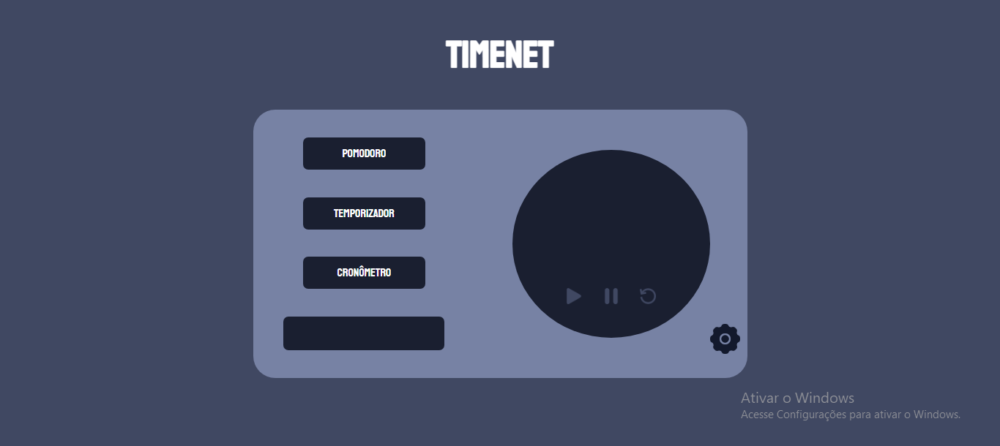

<section class="box-nt" style="display: flex; justify-content: center;">
    
</section>

---

<h1 align="center">TimeNet</h1>

TimeNet is a very simple web application. It contains simple clock functions, as well as a pomodoro function.

---

<h2 align="center">Design</h2>

---

<h2  align="center">Application demo</h2>

---

<h2  align="center">Project</h2>

---

<h2  align="center">Technologies</h2>

---

<h3 align="center">Status</h3>

    🚧 Em desenvolvimento... 🚧

